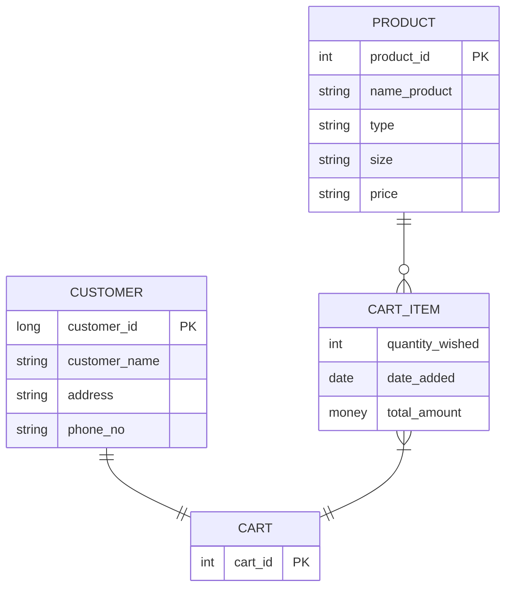

# Thực hiện các chức năng đơn giản với đề tài quản lý E-commerce (02-09-2022)


# Mục lục

## [Database](#database)
- [Diagram](#diagram)
- [Customer](#1-customer)
- [Product](#2-product)
- [Cart](#3-cart)
- [Cart_item](#4-cart_item)

## 1. [Data](#data)

- [Cusomer data](#customer-data)
- [Product data](#product-data)

## 2. [Viết api lấy tất cả sản phẩm với điều kiện(LESS_THAN, GREATER_THAN, EUQAL) ](#Câu-2)

- [LESS_THAN](#less_than)
- [GREATER_THAN](#greater_than)
- [EQUAL](#equal)
- [Exception](#exception)

## 3. [Viết một api với chức năng thêm cart bằng tham số `customer_id` của Customer](#Câu-3)

- [Thêm danh sách sản phẩm (product_id, quantity) vào cart với đối số truyền vào là customer_id](#thêm-danh-sách-sản-phẩm-product_id-quantity-vào-cart-với-đối-số-truyền-vào-là-customer_id)
- [Update cart_id vào customer](#update-cart_id-vào-customer)
- [Exception](#exception-1)

## 4. [Thực hiện gọi lại api số 3](#Câu-4)

- [Nếu đã có item trong cart, thực hiện tính toán và cập nhật lại item đó trong cart](#nếu-đã-có-item-trong-cart-thực-hiện-tính-toán-và-cập-nhật-lại-item-đó-trong-cart)

## 5. [Viết một api lấy danh sách thông tin của item theo **Cart** theo tham số `customer_id`](#Câu-5)

- [Tham số truyền vào bao gồm customer_id, name_product, offset, limit ](#tham-số-truyền-vào-bao-gồm-customer_id-name_product-offset-limit)

# Database

### Diagram


### 1. Customer

| Column            | Type                     | Nullable |
| :---------------- | ------------------------ | -------- |
| **`customer_id`** | `integer `               | not null |
| `customer_name`   | `character varying(50)`  | not null |
| `address`         | `character varying(100)` |          |
| `phone_no`        | `character(20)`          | not null |
| `cart_id`         | `integer`                |          |

### 2. Product

| Column           | Type                     | Nullable |
| :--------------- | :----------------------- | :------- |
| **`product_id`** | `integer`                | not null |
| `name_product`   | `character varying(100)` | not null |
| `type`           | `character(5)`           |          |
| `size`           | `character(3)`           |          |
| `quantity`       | `integer`                | not null |
| `price`          | `numeric`                |          |

### 3. Cart

| Column        | Type      | Nullable |
| :------------ | :-------- | :------- |
| **`cart_id`** | `integer` | not null |

### 4. Cart_item

| Column            | Type        | Nullable |
| :---------------- | :---------- | :------- |
| **`cart_id`**     | `integer`   | not null |
| **`product_id`**  | `integer`   | not null |
| `quantity_wished` | `integer`   | not null |
| `date_added`      | `timestamp` | not null |
| `total_amount`    | `numeric`   | not null |

# Data

### Customer data

| customer_id | customer_name   | address    | phone_no   | cart_id |
| ----------- | --------------- | ---------- | ---------- | ------- |
| 1           | Nguyen Duc Long | Quang Binh | 0906592672 |         |
| 2           | Nguyen Van A    | TP HCM     | 0912345678 |         |
| 3           | Nguyen Thi B    | Ha Noi     | 0908070605 |         |
| 4           | Le Thi D        | Da Nang    | 0903221122 |         |
| 5           | Tran Van C      | Hai Phong  | 0911223344 |         |

### Product data

| product_id | name_product  | type | size | quantity | price  |
| ---------- | ------------- | ---- | ---- | -------- | ------ |
| 1          | ao phong      | ao   | L    | 3        | 500000 |
| 2          | ao thun       | ao   | XL   | 35       | 55000  |
| 3          | ao phong2     | ao   | S    | 12       | 70000  |
| 4          | quan xanh     | quan | L    | 44       | 120000 |
| 5          | quan tay      | quan | S    | 12       | 100000 |
| 6          | quan den      | quan | S    | 55       | 170000 |
| 7          | giay fake     | giay | 36   | 44       | 120000 |
| 8          | giay real     | giay | 40   | 12       | 400000 |
| 9          | giay nai ki   | giay | 39   | 0        | 300000 |
| 10         | giay the thao | giay | 39   | 20       | 170000 |

# Câu 2

## LESS_THAN

#### Request: `GET` - http://localhost:8080/api/products/?price=100000&condition=LESS_THAN

#### Kết quả

```json
{
  "httpStatus": "OK",
  "message": "Query data successfully",
  "data": [
    {
      "product_id": 3,
      "name_product": "ao phong2",
      "type": "ao   ",
      "size": "S  ",
      "quantity": 12,
      "price": 70000
    },
    {
      "product_id": 2,
      "name_product": "ao thun",
      "type": "ao   ",
      "size": "XL ",
      "quantity": 31,
      "price": 55000
    }
  ]
}
```

## GREATER_THAN

#### Request: `GET` - http://localhost:8080/api/products/?price=490000&condition=GREATER_THAN

#### Kết quả

```json
{
  "httpStatus": "OK",
  "message": "Query data successfully",
  "data": [
    {
      "product_id": 1,
      "name_product": "ao phong",
      "type": "ao   ",
      "size": "L  ",
      "quantity": 0,
      "price": 500000
    }
  ]
}
```

## EQUAL

#### Request: `GET` - http://localhost:8080/api/products/?price=120000&condition=EQUAL

#### Kết quả

```json
{
  "httpStatus": "OK",
  "message": "Query data successfully",
  "data": [
    {
      "product_id": 4,
      "name_product": "quan xanh",
      "type": "quan ",
      "size": "L  ",
      "quantity": 44,
      "price": 120000
    },
    {
      "product_id": 7,
      "name_product": "giay fake",
      "type": "giay ",
      "size": "36 ",
      "quantity": 44,
      "price": 120000
    }
  ]
}
```

## Exception

### 1. Không tìm thấy product

#### Request: `GET` - http://localhost:8080/api/products/?price=1000&condition=EQUAL

_Chú ý: product phải thuộc 1-10_

#### Kết quả

```json
{
  "httpStatus": "NOT_FOUND",
  "data": "Product not exists"
}
```

### 2. Giá tiền không hợp lệ

#### Request: http://localhost:8080/api/products/?price=-1&condition=EQUAL

_Chú ý: Giá tiền phải phù hợp với dữ liệu_([Xem dữ liệu](#data))

#### Kết quả

```json
{
  "httpStatus": "BAD_REQUEST",
  "data": "price = -1 argument invalid"
}
```

### 3. Điều kiện không hợp lệ

#### Request: `GET` - http://localhost:8080/api/products/?price=10000&condition=EQUALL

\_Chú ý: giá trị `condition` phải là `LESS_THAN`, `GREATER_THAN`, `EQUALEQUAL`

#### Kết quả

```json
{
  "httpStatus": "BAD_REQUEST",
  "data": "Condition = EQUALL argument invalid"
}
```

# Câu 3

## Thêm danh sách sản phẩm (product_id, quantity) vào cart với đối số truyền vào là customer_id

#### Request: `POST` - http://localhost:8080/api/cart/5 (`customer_id = 5`)

#### Request body:

```json
[
  {
    "product_id": 7,
    "quantity_wished": 1
  },
  {
    "product_id": 3,
    "quantity_wished": 2
  }
]
```

#### kết quả

```json
{
  "httpStatus": "OK",
  "message": "Create cart successfully",
  "data": [
    {
      "product_id": 7,
      "cart_id": 5,
      "quantity_wished": 1,
      "total_amount": 120000
    },
    {
      "product_id": 3,
      "cart_id": 5,
      "quantity_wished": 2,
      "total_amount": 140000
    }
  ]
}
```

## Update `cart_id` vào customer

```sql
select * from customer_where customer_id =5;
```

#### Kết quả

| customer_id | customer_name | address   | phone_no   | cart_id |
| ----------- | ------------- | --------- | ---------- | ------- |
| 5           | Tran Van C    | Hai Phong | 0911223344 | 5       |

## Exception

### 1. Không tồn tại customer_id

#### Request: `POST` - http://localhost:8080/api/cart/100 (customer_id = 100)

_Chú ý: customer_id chỉ từ 1-5_

```json
{
  "httpStatus": "NOT_FOUND",
  "data": "Customer with id = 100 not exists"
}
```

### 2. Số lượng sản phẩm không hợp lệ

#### Request: `POST` - http://localhost:8080/api/cart/5

#### Request body (_chú ý: số lượng tại product_id = 7 là bằng 0_)

```json
[
  {
    "product_id": 7,
    "quantity_wished": 0
  },
  {
    "product_id": 3,
    "quantity_wished": 2
  }
]
```

#### Kết quả

```json
{
  "httpStatus": "BAD_REQUEST",
  "data": "Quantity of Product with id = 7 must be greater than 0"
}
```

### 3. Không tồn tại `product_id`

#### Request: `POST` - http://localhost:8080/api/cart/5

#### Request body (_Chú ý: chỉ tồn tại product_id từ 0 - 10_)

```json
[
  {
    "product_id": 11,
    "quantity_wished": 2
  },
  {
    "product_id": 3,
    "quantity_wished": 2
  }
]
```

#### Kết quả

```json
{
  "httpStatus": "NOT_FOUND",
  "data": "Product by id = 11 not exists"
}
```

### 4. Out of stock!!!!

#### Request: `POST` - http://localhost:8080/api/cart/5

#### Request body: (_Chú ý: Số lượng sản phẩm tại product_id chỉ còn lại 3_)

```json
[
  {
    "product_id": 1,
    "quantity_wished": 4
  },
  {
    "product_id": 3,
    "quantity_wished": 2
  }
]
```

#### Kết quả

```json
{
  "httpStatus": "BAD_REQUEST",
  "data": "Out of stock! quantity wished of product with id 1 must be less than 3"
}
```

# Câu 4:

## Nếu đã có item trong cart thực hiện tính toán và cập nhật lại item đó trong cart

#### cart lúc chưa thêm

| cart_id | product_id | quantity_wished | date_added                 | total_amount |
| ------- | ---------- | --------------- | -------------------------- | ------------ |
| 5       | 7          | 1               | 2022-09-01 23:34:25.031239 | 120000       |
| 5       | 3          | 2               | 2022-09-01 23:34:25.07035  | 140000       |

#### Request: `POST` - http://localhost:8080/api/cart/5

#### Request body:

```json
[
  {
    "product_id": 4,
    "quantity_wished": 5
  },
  {
    "product_id": 6,
    "quantity_wished": 7
  }
]
```

#### Kết quả

```json
{
  "httpStatus": "OK",
  "message": "Update cart successfully",
  "data": [
    {
      "product_id": 7,
      "cart_id": 5,
      "quantity_wished": 1,
      "total_amount": 120000
    },
    {
      "product_id": 3,
      "cart_id": 5,
      "quantity_wished": 2,
      "total_amount": 140000
    },
    {
      "product_id": 4,
      "cart_id": 5,
      "quantity_wished": 5,
      "total_amount": 600000
    },
    {
      "product_id": 6,
      "cart_id": 5,
      "quantity_wished": 7,
      "total_amount": 1190000
    }
  ]
}
```

# Câu 5

### Tham số truyền vào bao gồm customer_id, name_product, offset, limit

#### Dữ liệu:

```sql
 select pr.product_id, name_product, size, type, price, quantity_wished, cart_id
 from product pr, cart_item ci
 where pr.product_id = ci.product_id and cart_id = 5;
```

| product_id | name_product  | size | type | price  | quantity_wished | customer_id |
| ---------- | ------------- | ---- | ---- | ------ | --------------- | ------------- |
| 4          | quan xanh     | L    | quan | 120000 | 5               | 5             |
| 6          | quan den      | S    | quan | 170000 | 7               | 5             |
| 7          | giay fake     | 36   | giay | 120000 | 6               | 5             |
| 2          | ao thun       | XL   | ao   | 55000  | 7               | 5             |
| 10         | giay the thao | 39   | giay | 170000 | 5               | 5             |
| 3          | ao phong2     | S    | ao   | 70000  | 4               | 5             |

#### Request: `GET` - http://localhost:8080/api/cart/?customer-id=5&product-name=ao&offset=0&limit=6

| customer_id | product_name | offset | limit |
| ----------- | ------------ | ------ | ----- |
| 5           | ao           | 1      | 2     |

#### Kết quả

```json
{
  "httpStatus": "OK",
  "message": "Show product success fully",
  "data": [
    {
      "product_id": 10,
      "name_product": "giay the thao",
      "type": "giay ",
      "size": "39 ",
      "price": 170000,
      "quantity_wished": 5
    },
    {
      "product_id": 3,
      "name_product": "ao phong2",
      "type": "ao   ",
      "size": "S  ",
      "price": 70000,
      "quantity_wished": 4
    }
  ]
}
```
